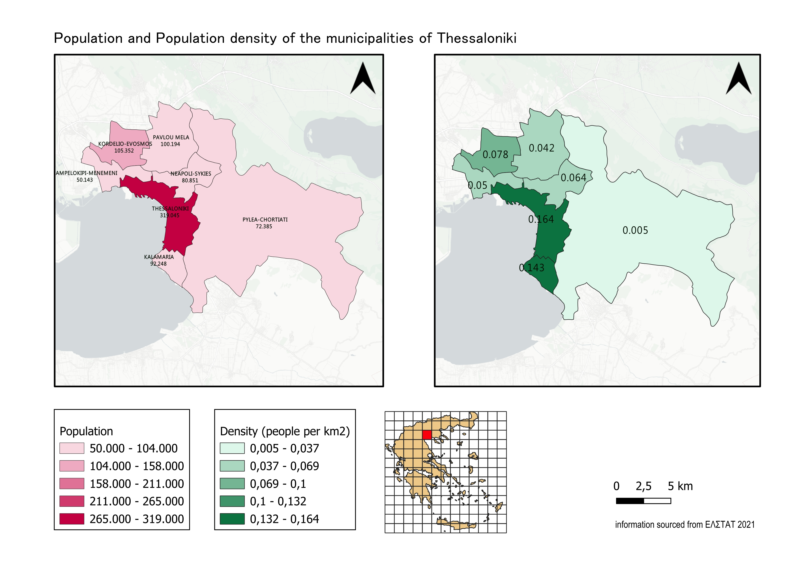
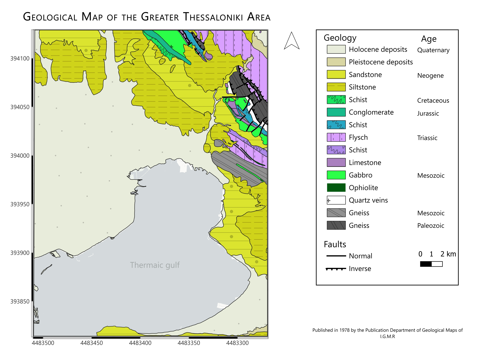

<h1>Hi, I'm Alexandros</h1> 

I am a GIS analyst interested in urban and environmental analysis with a BSc in Geology from the Aristotle University Of Thessaloniki, and below i have listed some of my projects to showcase my skills.

# Population Analysis of Thessaloniki

- This project provides a clear understanding of the population dispersion across the Municipalities of the urban area of Thessaloniki.

\- The main goal of this project is to provide information that can support urban planning and decision making.

\- The data that was used is the population of each Municipality which was sourced by ΕΛΣΤΑΤ and the municipality boundaries which were sourced from the open data portal of the Municipality of Thessaloniki.

\- The project involved data preparation and attribute calculation, spatial analysis, and cartographic design. Population density was calculated by dividing total population by municipal area, and the results were visualized using choropleth maps.

\- The analysis shows that the central municipality of Thessaloniki has both the highest population and the highest population density compared to the surrounding municipalities, reflecting the strong urban core of the metropolitan area.

  
# Geological Map of The Greater Thessaloniki Area

- This project is a cartographic visualization of the Greater Thessaloniki Area and it showcases the lithology the faults and chronological successiom of the geological background.
  
- The aim of this project is to showcase the geology of the area with the intent of providing information which could be used for geotechnical purposes. 
  
- The data that was used was sourced from I.G.M.R (Ι.Γ.Μ.Ε) and is a map that was published in 1978. 
  
- The methods that were used involved data management, polygon mapping of the original map, classification of the data, map design showcasing clear geologic information and cartographic design.

  

<h2> 🤳 Connect with me:</h2>

[][linkedin]

[linkedin]: https://linkedin.com/in/alexandros-chasiridis-579705311
